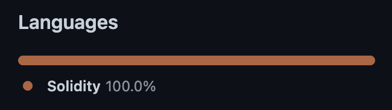

# Foundry Pilled

Have you found yourself Foundry-pilled but don't know where to start? 
This repo showcases many of the benefits Foundry could bring to your project! 
The main benefit being one *single* language for everything related to smart contracts.
Everything in this repo is written in Solidity: contracts & tests!

<br/>
<p align="center">

</p>


# Getting Started

Please read the readme's in the [src](https://github.com/RensR/Foundry-pilled/tree/master/src) and [test](https://github.com/RensR/Foundry-pilled/tree/master/test) folders for more information about the source contracts and the tests.

## Installation

Installing and configuring Foundry is lightning fast.

Please install the following:

-   [Foundry / Foundryup](https://github.com/foundry-rs/foundry)
    -  Install `foundryup` with the following command or check the [official docs](https://book.getfoundry.sh/getting-started/installation)
    - `curl -L https://foundry.paradigm.xyz | bash`
    -   To install or update the Foundry components simply run `foundryup`
    -   This will install `forge`, `cast`, and `anvil`


## Configuration

Foundry works out of the box! But if you need any custom logic, the configuration lives in `foundry.toml`. 
When adding Foundry to an existing project, you might want to remap the testing and the src folders.
In this repo we've kept the custom configuration to a minimum, only specifying the `optimizer_runs` value and adding some CI and `fmt` config.
For more configuration options [check the docs](https://book.getfoundry.sh/config/).

# Features

Foundry comes with many features and is still under very active development.
For now, this repository will mainly focus on Forge, the testing component of Foundry.
Besides Forge there is `Cast`, a command-line tool for performing Ethereum RPC calls and `Anvil`, a local testnet node.

## [Forge](https://book.getfoundry.sh/forge/)

Forge offers a suite of functionality and QoL improvements for Solidity developers.
Some of the features we're using are tests `test`, the formatter `fmt`, the gas snapshot `snapshot` and coverage `coverage`.
For more information on Forge subcommands read the [official docs](https://book.getfoundry.sh/reference/forge/).

### Common CLI Commands

The following CLI command will be used very frequently. 


### Testing

```
forge test
```

or test a specific contract with

```
forge test --match-contract CONTRACT_NAME
```

### Formatter

```
forge fmt
```

### Gas Snapshot

```
forge snapshot
```

## [Cast](https://book.getfoundry.sh/cast/)

Cast is Foundry's command-line tool for performing Ethereum RPC calls. 
You can make smart contract calls, send transactions, or retrieve any type of chain data - all from your command-line!

## [Anvil](https://book.getfoundry.sh/anvil/)

Anvil is a local testnet node shipped with Foundry. 
You can use it for testing your contracts from frontends or for interacting over RPC.


## CI

We've automated building, testing, gas snapshots and formatting in our [CI pipeline](https://github.com/RensR/Foundry-pilled/blob/master/.github/workflows/test.yml).
PRs can only be merged when all tests are green, the gas-snapshot is up-to-date and the formatting is correct. 
This ensures only high quality code reaches the main branch.


# Contributing

Contributions are always welcome!